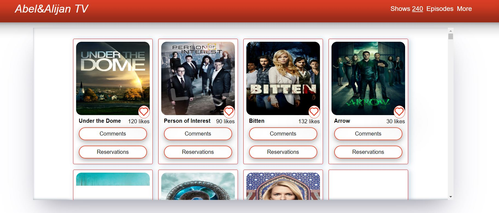
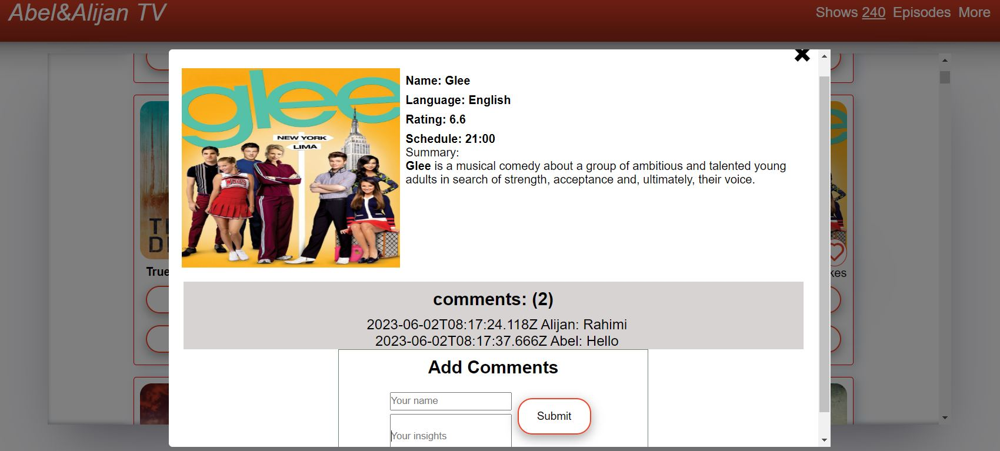

<!-- Open pull request using the following structure

  ## Project title: subtitle

  ### 🌟Branch features:

  - i
  - ii
  - iii

-->

> # Amazing Movies

| Project Veiw Screenshots                                                                                             |
| -------------------------------------------------------------------------------------------------------------------- |
| 

   |
| 

 |

# 📗 Table of Contents

- [📖 About the Project](#about-project)
  - [🛠 Built With](#built-with)
    - [Tech Stack](#tech-stack)
    - [Key Features](#key-features)
  - [🚀 Live Demo](#live-demo)
- [💻 Getting Started](#getting-started)
  - [Setup](#setup)
  - [Prerequisites](#prerequisites)
  - [Install](#install)
  - [Usage](#usage)
  - [Run tests](#run-tests)
  - [Deployment](#triangular_flag_on_post-deployment)
- [👥 Authors](#authors)
- [🔭 Future Features](#future-features)
- [🤝 Contributing](#contributing)
- [⭐️ Show your support](#support)
- [🙏 Acknowledgements](#acknowledgements)
- [❓ FAQ (OPTIONAL)](#faq)
- [📝 License](#license)

<!-- PROJECT DESCRIPTION -->

# 📖 [Amazing Movies] 

> **[Amazing Movies]** is a web application based on a TVmaze API to displays data about TV series and movies. A user can comment, like, and also view information about the movie. comments and liks are based on involvement-API.

## 🛠 Built With 

### Tech Stack 

- 
Client

    <ul>
      <li><a href="#">HTML</a></li>
      <li><a href="#">CSS</a></li>
      <li><a href="#">API</a></li>
      <li><a href="#">JavaScript</a></li>
      <li><a href="#">Webpack 5</a></li>
      <li><a href="#">Jest Testing Framework</a></li>
    </ul>

### Key Features 

- **[Fetch and send data to an API]**
- **[Save and retrieve likes, comments]**
- **[Dynamic data]**
- **[Unit testing using jest enviroment]**

(<a href="#readme-top">back to top</a>)

<!-- LIVE DEMO -->

## 🚀 Live Demo 

> - [Live Demo Link](https://programkingabel.github.io/MICROVERSE-JS-CAPSTONE/dist/)
> - [Introduction to Project]
> - [Introduction to Project](https://drive.google.com/file/d/1mjjlcy3fIjubCG689RiTKAg8Q4hdrHfV/view?usp=sharing)

(<a href="#readme-top">back to top</a>)

<!-- GETTING STARTED -->

## 💻 Getting Started 

To get a local copy up and running, follow these steps:

### Prerequisites

In order to run this project you need:

- A browser of you choice.
- A text editor of your choice.
- An installed node.js on your local system

### Setup

Clone this repository to your desired folder:

- Use the following Commands:

      cd your-desired-folder
      git clone git@github.com:ProgramKingAbel/MICROVERSE-JS-CAPSTONE.git

### Install

Install this project with:

- You can deploy this projec on hosting provider of your choise or you can deploy it on github pages.

### Usage

- Use following commands to run on your local system:

      npm run build
      npm run dev

### Run tests

- Run the following script and style test:

      npm test
      npx eslint .
      npx stylelint "**/*.{css}"

### Deployment

You can deploy this project using:

- Free deployment services like GitHub pages.
- Any deployment services of your choice.

(<a href="#readme-top">back to top</a>)

## 👥 Authors 

👤 **Abel Matunda Morara**

- GitHub: [@ProgramKingAbel](https://github.com/ProgramKingAbel)
- Twitter: [@CEOAbel1](https://twitter.com/CeoAbel1)
- LinkedIn: [C.E.O Abel Matunda Morara](https://www.linkedin.com/in/abelmatundamorara-451340250/)

👤 **Alijan Rahimi**

- GitHub: [@Alijan-Rahimi](https://github.com/rahimialijan)
- Twitter: [@AlijanRahimi10](https://twitter.com/AlijanRahimi10)
- LinkedIn: [Alijan-Rahimi](https://www.linkedin.com/in/alijan-rahimi-18389ab3)

(<a href="#readme-top">back to top</a>)

## 🔭 Future Features 

- [ ] **[Add mobile version]**

(<a href="#readme-top">back to top</a>)

## 🤝 Contributing 

Contributions, issues, and feature requests are welcome!

Feel free to check the [issues page](https://github.com/ProgramKingAbel/MICROVERSE-JS-CAPSTONE/issues).

(<a href="#readme-top">back to top</a>)

## ⭐️ Show your support 

If you like this project, give it a star

(<a href="#readme-top">back to top</a>)

## 🙏 Acknowledgments 

We would like to thank Microverse and our coding partners.

(<a href="#readme-top">back to top</a>)

## ❓ FAQ (OPTIONAL) 

- **How to make it mobile friendly?**

  - Put a viewport tag in the header

- **How to design the site?**

  - Draw a mockup before start to code

(<a href="#readme-top">back to top</a>)

## 📝 License 

This project is [MIT](./LICENSE) licensed.

(<a href="#readme-top">back to top</a>)

